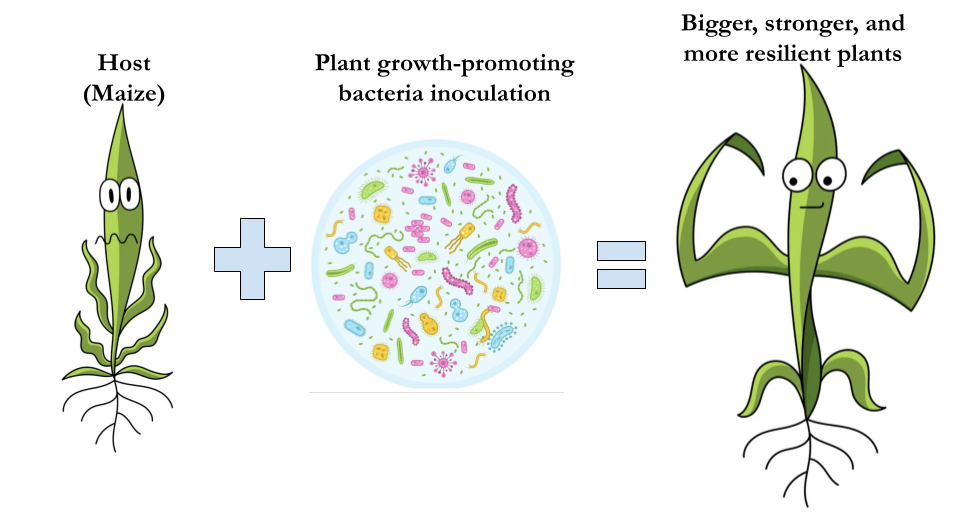
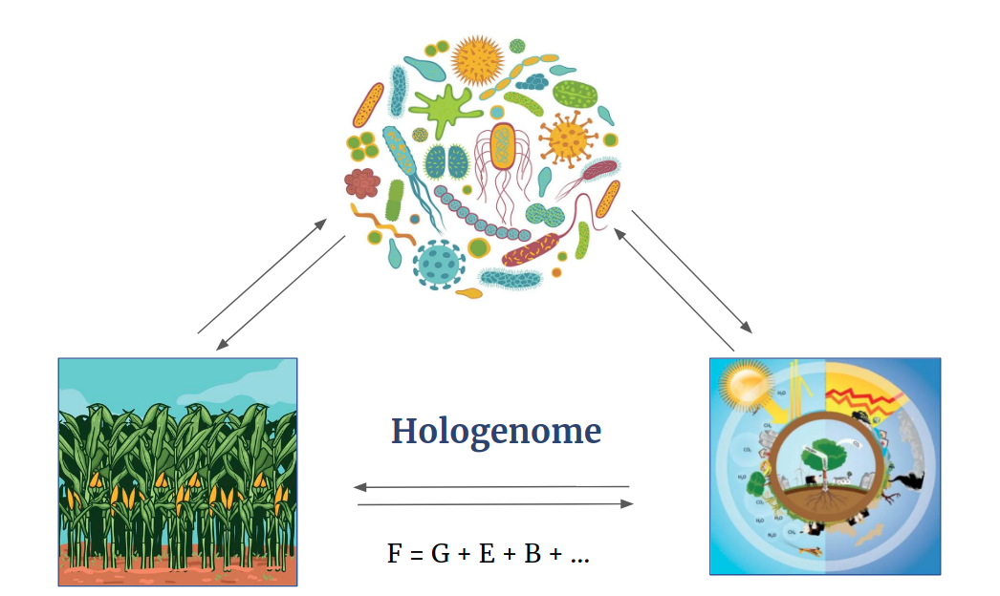
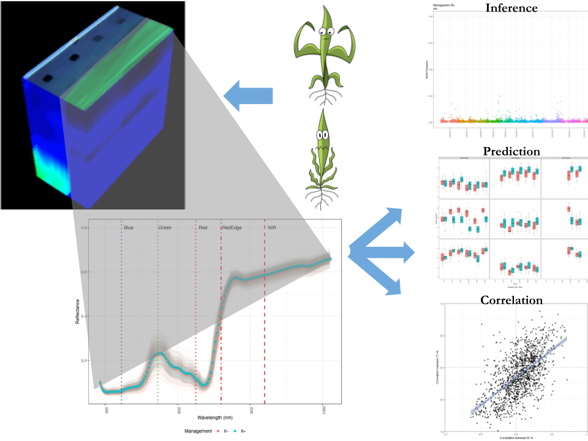
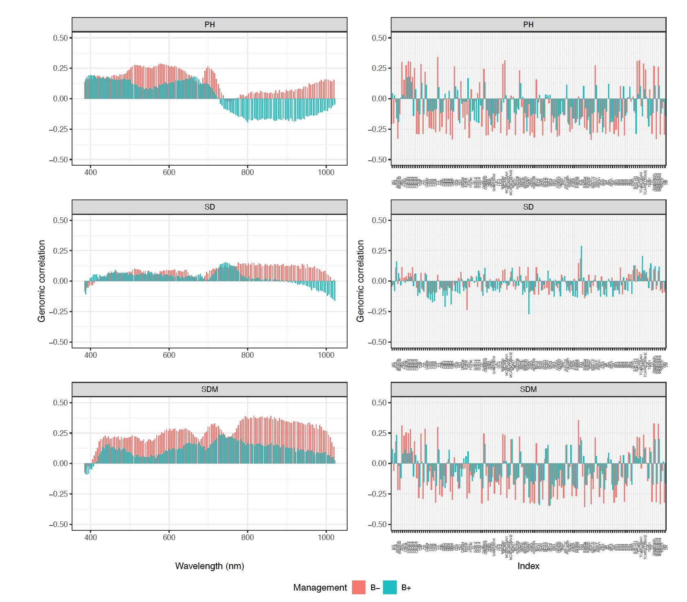

class: animated, fadeIn

# Summary
--

+ Allogamous Breeding Lab and Lab of Animal Data Sciences
+ Updates

--
+ Motivations
 - Why study plant growth-promoting bacteria (PGPB)?
 - Why study the genetic architecture of the response to PGPB?
 - Why use hyperspectral imagery?

--
+ Material and Methods
  - Genetic material
  - PGPB
  - Greenhouse experiment 
  - hyperspectral data collection

--
+ Studies:
 1. Classification of plant growth-promoting bacteria inoculation status and prediction of growth-related traits in tropical maize using hyperspectral image and genomic data
 2. Integrating hyperspectral and multi-phenotype genome-wide association analysis to dissect the genetic architecture of growth-related phenotypes in maize under inoculation with plant growth-promoting bacteria inoculation
 
---
class: animated, fadeIn

# Allogamous Breeding Lab and Lab of Animal Data Sciences
```{r, echo=FALSE, out.width="95%",fig.cap="", fig.align="center"}

```

---
class: animated, fadeIn
```{r, echo=FALSE, out.width="110%",fig.cap="", fig.align="center"}

```

---
class: animated, fadeIn
```{r, echo=FALSE, out.width="120%",fig.cap="", fig.align="center"}
knitr::include_graphics("TPPJ.png")
```

---
class: animated, fadeIn

# Why study plant growth-promoting bacteria (PGPB)?
```{r, echo=FALSE, out.width="95%",fig.cap="", fig.align="center"}

```

---
class: animated, fadeIn

## Why study the genetic architecture of the response to PGPB?
```{r, echo=FALSE, out.width="95%",fig.cap="", fig.align="center"}

```

---
class: animated, fadeIn
# Why use hyperspectral imagery?
```{r, echo=FALSE, out.width="95%",fig.cap="", fig.align="center"}

```

---
class: animated, fadeIn

# Goal 

+ Using hyperspectral image and genomic data to assess the genetic architecture of the symbioses between maize and plant growth-promoting bacteria and improve the predictive ability for growth-related traits 

<br /> <br /> <br /> <br />

```{r, echo=FALSE, out.width="150%"}
knitr::include_graphics("Figures/figs1.png")
```

---
class: animated, fadeIn

# Materials used throughout the studies 
+ Greenhouse condition
+ Early stage of maize development (six fully expanded)
+ 360 inbred lines
+ 13,826 SNPs
+ Two management both under nitrogen limited conditions: 
  - **B+** Syntetic population of 4 PGPB: 
      * *Bacillus thuringiensis* RZ2MS9
      * *Delftia* sp. RZ4MS18 
      * *Pantoea agglomerans* 33.1
      * *Azospirillum brasilense* Ab-v5
  - **B-** Without PGPB 
+ Manually measured phenotypes: 
  - Plant height (PH)
  - Stalk diameter (SD) 
  - Shoot dry mass (SDM)
+ Hyperspectral phenotypes: 
  - 150 wavelengths (from 386 to 1021 nm)
  - 131 hyperspectral index

---
class: animated, fadeIn
# Hyperspectral image acquisition
```{r, echo=FALSE, out.width="90%",fig.cap="", fig.align="center"}

```
<p style="font-family: times, serif; font-size:11pt; font-style:italic">
Figure. Summary of data acquisition and processing. A) the hyperspectral benchtop camera used for data collection; B) region of interest of the last completed expanded leaf; C) cube image; and D) image mask
</p>

---
class: animated, fadeIn
# Exploratory analysis
```{r, echo=FALSE, out.width="70%",fig.cap="", fig.align="center"}

```
<p style="font-family: times, serif; font-size:11pt; font-style:italic">
Figure. A: Spectral signatures of the maize genotypes with (B+) and without (B-) PGPB inoculation. B: Principal component biplot of the 360 maize genotypes and 150 spectral wavelengths with (B+) and without (B-) PGPB inoculation.
</p>

---
class: animated, fadeIn
# Exploratory analysis
```{r, echo=FALSE, out.width="70%",fig.cap="", fig.align="center"}
knitr::include_graphics("papers/2-2.jpeg")
```
<p style="font-family: times, serif; font-size:11pt; font-style:italic">
Figure. Phenotypic correlations between plant height (PH), Stalk diameter (SD), and shoot dry mass (SDM) and hyperspectral reflectance (left) and hyperspectral index (right) with and without PGPB inoculation (B+ and B-).
</p>

---
class: inverse, animated, fadeIn
 <br /> <br /> <br /> <br /> <br /> <br />
<center>
<h1>
Classification of plant growth-promoting bacteria inoculation status and prediction of growth-related traits in tropical maize using hyperspectral image and genomic data
</h1>
</center>

---
class: animated, fadeIn
# Goals

+ Evaluate the utility of hyperspectral image data to classify PGPB inoculation status

+ Compare the predictive ability of genomic prediction, hyperspectral prediction, and their combination for growth-related phenotypes under PGPB management.  

---
class: animated, fadeIn
# Cross-validation scheme
```{r, echo=FALSE, out.width="80%",fig.cap="", fig.align="center"}
knitr::include_graphics("papers/1-1.jpeg")
```
<p style="font-family: times, serif; font-size:11pt; font-style:italic">
Figure. Graphic representation of the cross-validation design using the hyperspectral image and genomic data for A. classification of inoculation status and B. Prediction of growth-related phenotypes.
</p>
---
class: animated, fadeIn

# Single and multi-omic models
<p style="font-family: times, serif; font-size:11pt; font-style:italic">
Table. List of models and covariates included in the analysis.
</p>
```{r, echo=FALSE, out.width="70%",fig.cap="", fig.align="center"}
knitr::include_graphics("papers/1-2.jpeg")
```

---
class: animated, fadeIn

# PGPB inoculation classification 
```{r, echo=FALSE, out.width="70%",fig.cap="", fig.align="center"}
knitr::include_graphics("papers/1-3.jpeg")
```
<p style="font-family: times, serif; font-size:11pt; font-style:italic">
Figure. Classification accuracy of inoculation status (B+ and B-) using 150 hyperspectral bands. 
</p>

---
class: animated, fadeIn
# Growth-related phenotypes prediction
```{r, echo=FALSE, out.width="80%",fig.cap="", fig.align="center"}
knitr::include_graphics("papers/1-4.png")
```
<p style="font-family: times, serif; font-size:11pt; font-style:italic">
Figure. Predictive ability of plant height (PH), stalk diameter (SD), and shoot dry mass (SDM) using phenomic prediction, genomic prediction, and multi-omic prediction models in each management condition (B+ and B-). 
</p>


---
class: animated, fadeIn
# Conclusion

+ Hyperspectral reflectance data can classify plant growth-promoting bacteria inoculation status

+ Phenomic prediction performs better than genomic prediction depending on the target phenotype

+ AutoML is a promising approach for automating hyperparameter tuning for classification and prediction

---
class: inverse, animated, fadeIn
 <br /> <br /> <br /> <br /> <br />
<center>
<h1>
Integrating hyperspectral and multi-phenotype genome-wide association analysis to dissect the genetic architecture of growth-related phenotypes in maize under inoculation with plant growth-promoting bacteria inoculation
</h1>
</center>

---
class: animated, fadeIn
# Goals

+ Develop a pipeline to integrate phenomics data into GWAS framework

+ Employ multi-phenotype GWAS, PheWAS, and gene annotation  in order to identify possible candidate genes to pleiotropic effects 

+ Identify candidate phenotypes responsible for changes in the hyperspectral reflectance

---
class: animated, fadeIn
# Materials and Methods
+ Phenotypes:
  - Manually measured phenotypes: 
     * Plant height (PH)
     * Stalk diameter (SD) 
     * Shoot dry mass (SDM)
  - Hyperspectral phenotypes: 
     * 150 wavelengths (from 386 to 1021 nm)
     * 131 hyperspectral index

+ Bayesian GWAS
  - BayesC 
  - $\pi$ = 0.99
  - Model frequency 

+ Phenome-wide association studies (PheWAS)


---
class: animated, fadeIn
# Genomic heritability
```{r, echo=FALSE, out.width="70%",fig.cap="", fig.align="center"}
knitr::include_graphics("papers/2-3.jpeg")
```
<p style="font-family: times, serif; font-size:11pt; font-style:italic">
Figure. Genomic heritability for 150 wavelengths and 131 hyperspectral indices with and without inoculation with PGPB (B+ and B-)
</p>

---
class: animated, fadeIn
# Genomic correlation
```{r, echo=FALSE, out.width="70%",fig.cap="", fig.align="center"}

```
<p style="font-family: times, serif; font-size:11pt; font-style:italic">
Figure. Genomic correlation for 150 wavelengths and 131 hyperspectral indices with and without inoculation with PGPB (B+ and B-)
</p>

---
class: animated, fadeIn
#  Manually measured phenotype GWAS
```{r, echo=FALSE, out.width="70%",fig.cap="", fig.align="center"}

```
<p style="font-family: times, serif; font-size:11pt; font-style:italic">
Figure. Manhatan plot for manually measured phenotypes (plant height, PH; stalk diameter, SD; and shoot dry mass, SDM) under with and without PGPB inoculation (B+ and B-)
</p>

---
class: animated, fadeIn
# Phenome-wide association studies (PheWAS)
```{r, echo=FALSE, out.width="65%",fig.cap="", fig.align="center"}
knitr::include_graphics("papers/2-6.jpeg")
```
<p style="font-family: times, serif; font-size:11pt; font-style:italic">
Figure. PheWAS for the 10 highest model frequency SNPs for plant height (PH), stalk diameter (SD), and shoot dry mass (SDM) for B+ management
</p>
---
class: animated, fadeIn
# Multi-phenotype GWAS
```{r, echo=FALSE, out.width="70%",fig.cap="", fig.align="center"}
knitr::include_graphics("papers/2.gif")
```
<p style="font-family: times, serif; font-size:11pt; font-style:italic">
Figure. Multi-phenotype GWAS for the 281 hyperspectral phenotype under B+ management 
</p>

---
class: animated, fadeIn
# Multi-phenotype GWAS
<p style="font-family: times, serif; font-size:11pt; font-style:italic">
Table. Summary of multi-phenotype GWAS for the 281 hyperspectral phenotypes and gene annotation.
</p>
```{r, echo=FALSE, out.width="70%",fig.cap="", fig.align="center"}

```


---
class: animated, fadeIn
# Shiny app
```{r, echo=FALSE, out.width="90%",fig.cap="", fig.align="center"}
knitr::include_graphics("Figures/1.jpeg")
```
<p style="font-family: times, serif; font-size:11pt; font-style:italic">
Figure. Shiny APP
</p>
management
---
class: animated, fadeIn
# Shiny app
```{r, echo=FALSE, out.width="90%",fig.cap="", fig.align="center"}
knitr::include_graphics("Figures/2.jpeg")
```
<p style="font-family: times, serif; font-size:11pt; font-style:italic">
Figure. Shiny APP
</p>

---
class: animated, fadeIn
# Conclusion

+ Hyperspectral reflectance can assess the genetic architecture of growth-related phenotypes in maize

+ PheWAS analysis is a promossing tool for genetic architecture studies using hyperspectral data

+ Shiny app for multi-phenotype Manhattan plots is a user-friendly tool

---
class: animated, fadeIn
# Next steps

+ Integrating high-throughput phenotyping and random regression to dissect the genetic architecture of plant growth-promoting bacteria response in tropical maize

+ Assessing plant vigor in the early stage of maize development under inoculation with plant growth promoting bacteria through low-resolution thermal images


---
class: animated, fadeIn

<br /> <br /> <br /> <br /> <br /> <br />
#.center[Thank you]

###.right[ Rafael Massahiro Yassue ]
.right[[rafael.yassue@usp.br](mailto:rafael.yassue@usp.br?subject=%20Presentation)]
.right[https://rafaelyassue.github.io/cv-online/]
```{r, echo=FALSE, out.width="50%",fig.cap="", fig.align="right"}

```